# Elektron Team - WRO Future Engineers 2025 - Bosnia and Herzegovina

## Content

* `t-photos` contains 2 photos of the team (an official one and one funny photo with all team members)
* `v-photos` contains 6 photos of the vehicle (from every side, from top and bottom)
* `video` contains the video.md file with the link to a video where driving demonstration exists
* `schemes` contains schematic diagrams of the driving base.
* `src` contains code of control software for all components which were programmed to participate in the competition.
* `models` is for the files for models used by 3D printers to produce the vehicle elements.
* `other` is for other files which can be used to understand how to prepare the vehicle for the competition.

## Introduction

This is the public repository for our team and the work we have done on our robot.

  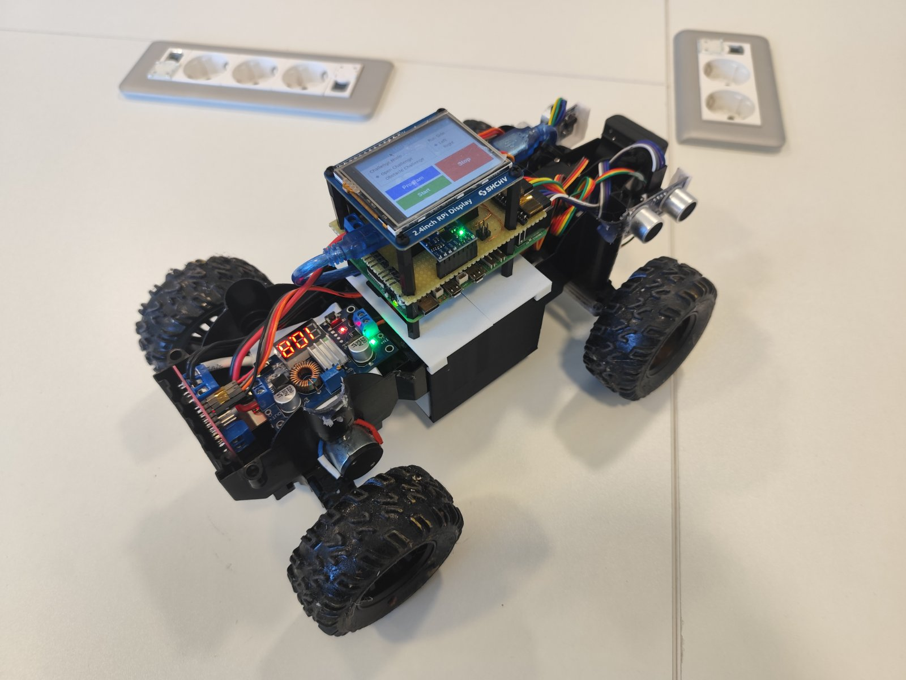
  &nbsp;
  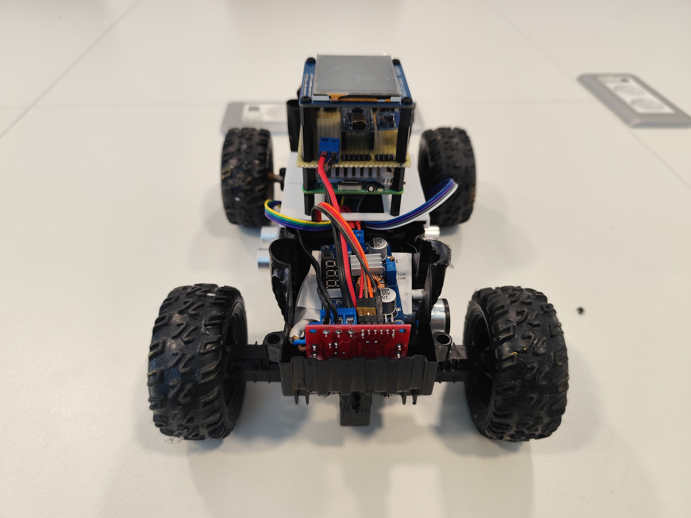

## Design elements

### Technical specifications
- Power: 3s1p Li-Ion Battery (EVE ICR18650-26v)
- Control: Raspberry Pi 5 8GB SBC
- Movement: Brushed motor
- Steering: 180 degree Servo based
- Sensors: 3x Ultrasonic sensors, Camera, IMU Sensor
- Displays: 2.4 Inch LCD Touch Display

### Driving elements

For the driving base we have chosen a pre-made RC car driving base due to time constraints. The main driving motor is controled by a L298N Motor H-Bridge controller and a 180 degree servo for steering. 

  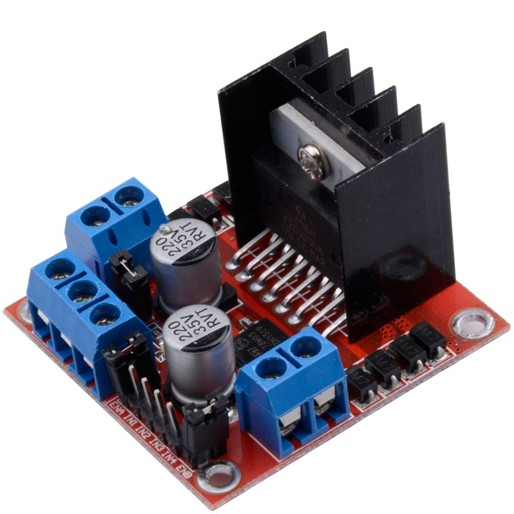
  &nbsp;
  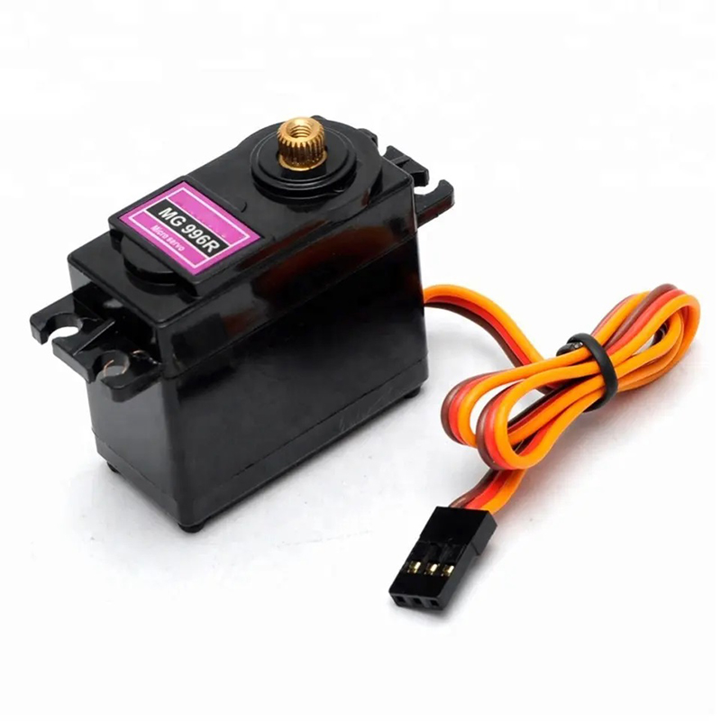
  &nbsp;
  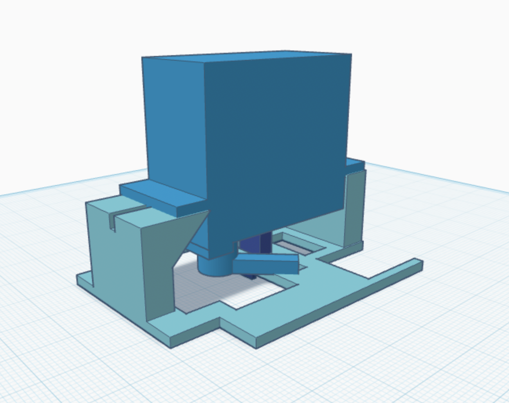

### Cameras & Sensors

On our robot we have utilised a MPU-6050 IMU sensor for detecting the rotation angle when steering. 
The "eyes" of the operation are a set of 3 HC-SR04 Ultrasonic sensors and a standard USB Webcam.

  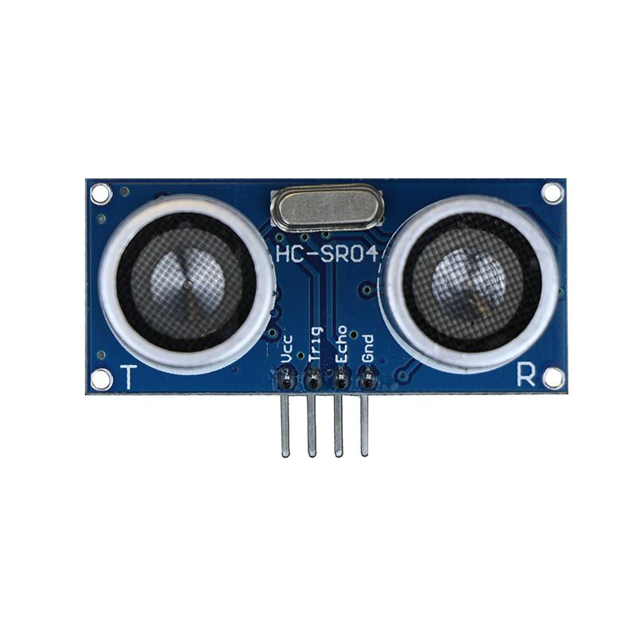
  &nbsp;
  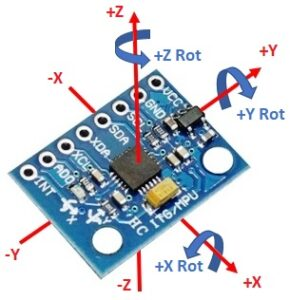
  &nbsp;
  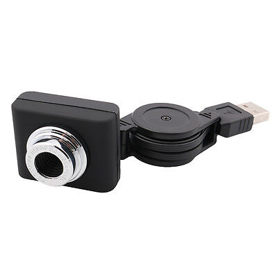

### Power supply and control elements

For the power supply we chose a custom made 18650 based battery in the 3s1p configuration which can be quickly charged with USB-C at 3A continuous. 
This gives us around 27.5Wh (2.55Ah @ 10.8v nominal) to work with which is plenty for the job at hand.

  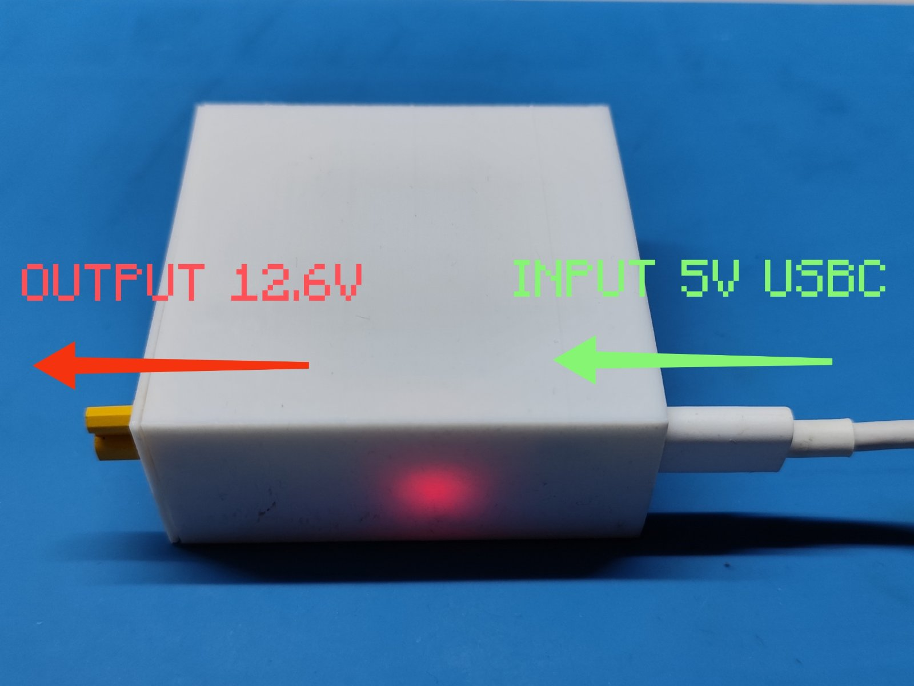
  &nbsp;
  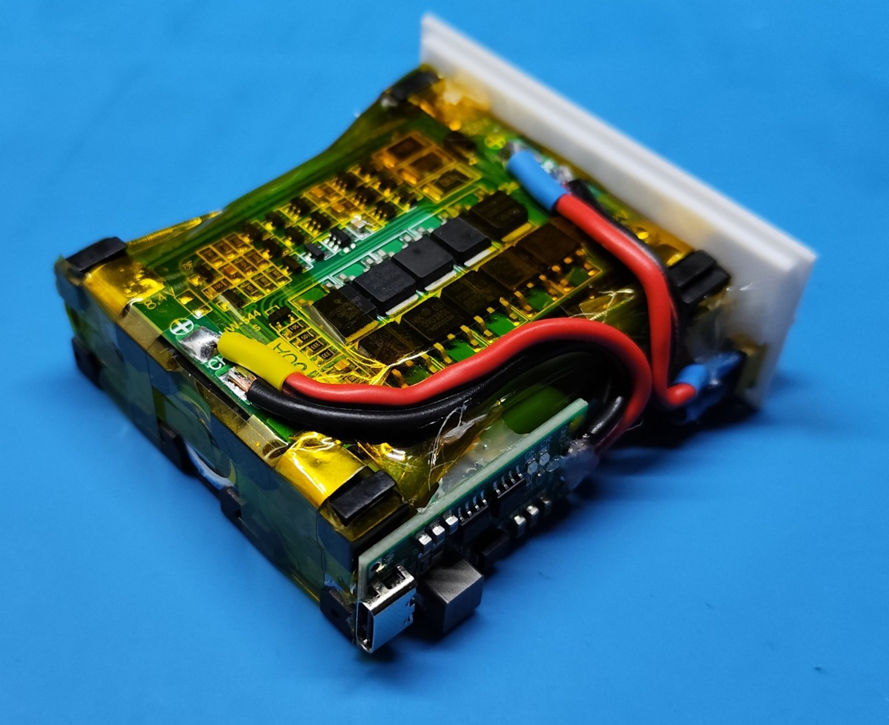

The robot is based on a Raspberry Pi 5 which requires a stable power input of 5v @ 5A, for this job we have first chosen an UBEC voltage regulator, but due to the specific adapter we got not actually being able to handle the Pi, we had to switch to a more readily available replacement, the XL4015.

  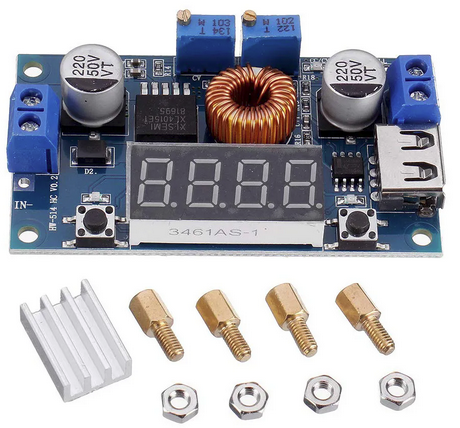
  &nbsp;
  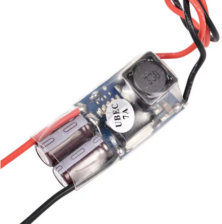

We have designed a custom Pi GPIO shield to more easily wire up all of our power sources and sensors. The design for this PCB can be found in the schemes folder.

  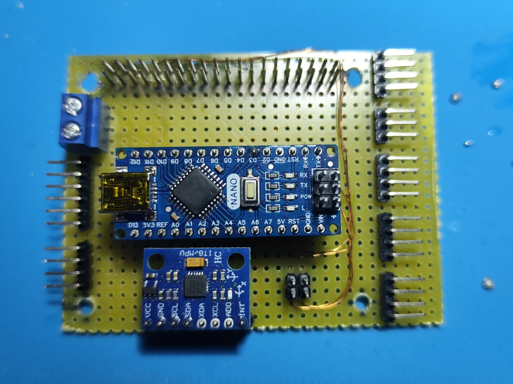
  &nbsp;
  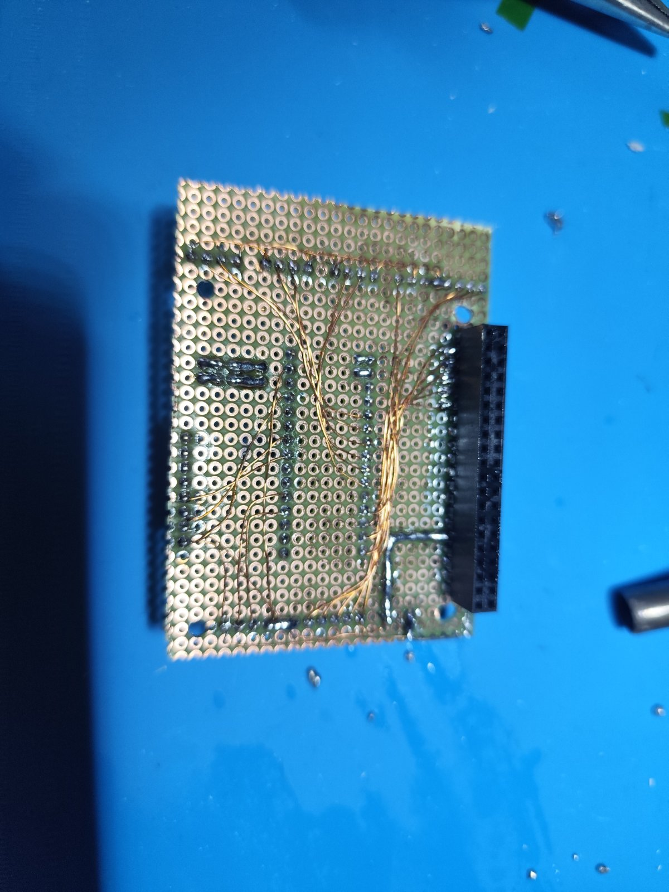
  &nbsp;
  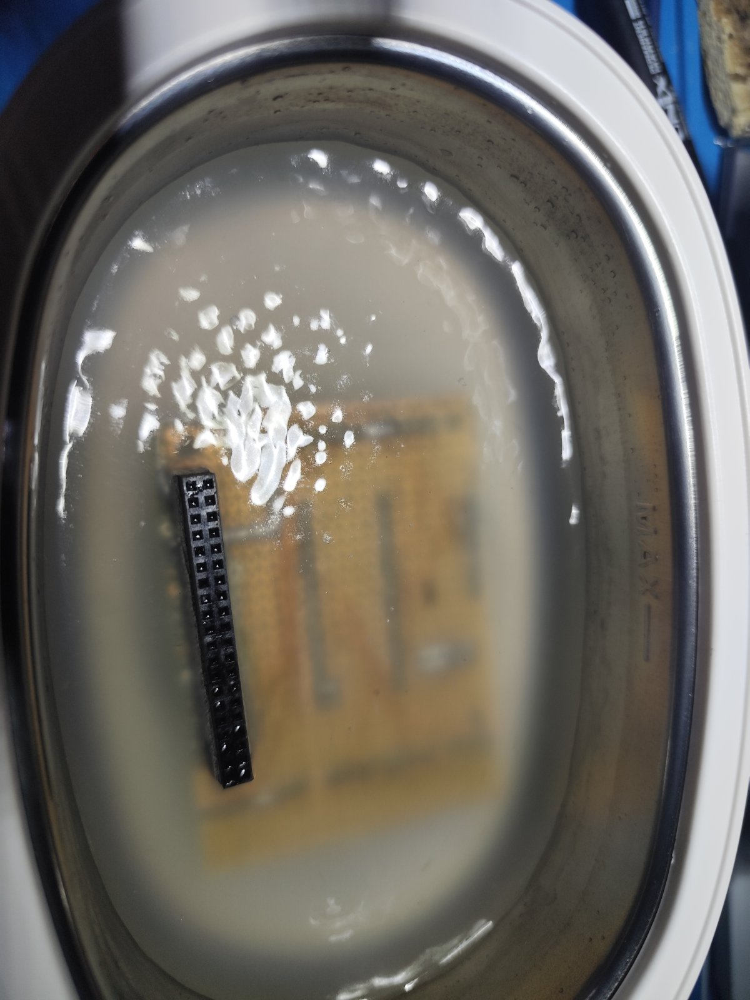

On this specific shield you can find an Arduino nano which is used to control all of the sensor inputs and motor outputs. This takes load off of the Raspberry Pi and allows for easier coding. The Arduino communicates to the Pi using a direct UART interface between the two which allows the Nano to handle the "Open Challange" all by itself reducing overall battery consumption (unlike our previous design where the Pi controlled everything).

The shield itself is a major improvement to the earlier revision as it no longer relies on a 20cm long gpio extension wire to the Pi which caused us major issues with powering the Pi because of low quality copper .

### Code

We have written most of our code in C++ using the WiringPi library for interfacing the Pi GPIO, Python (mainly OpenCV for obstacle detection) and Arduino flavored c++. 
You can find the code in the src folder and the instructions on how to use it.
